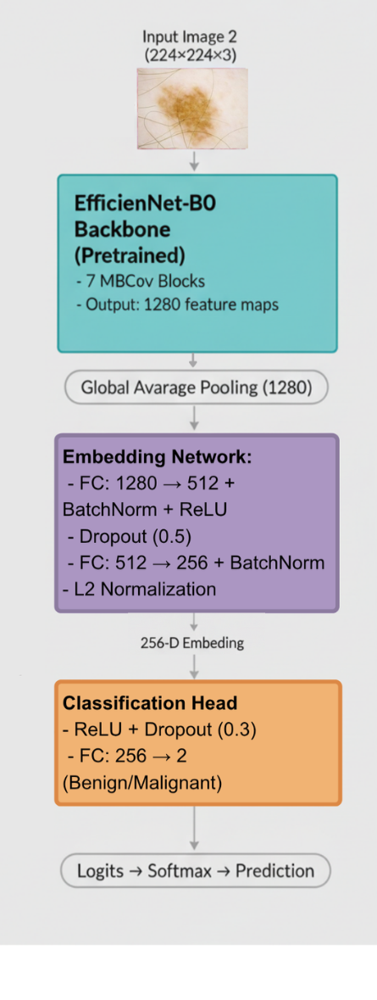
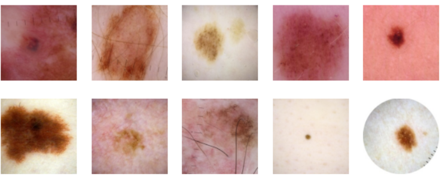
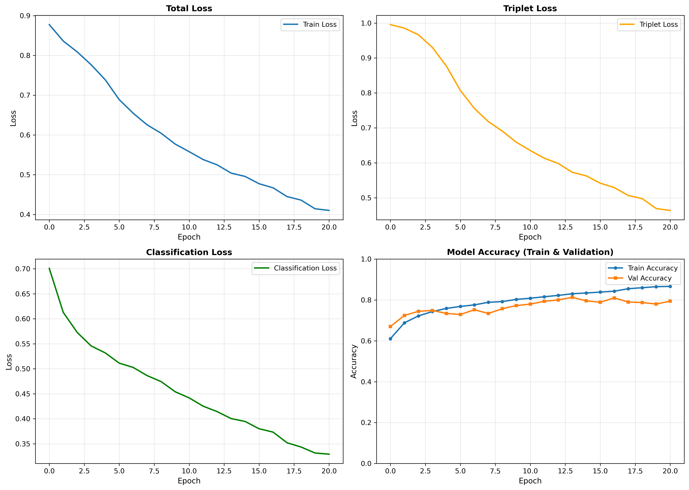
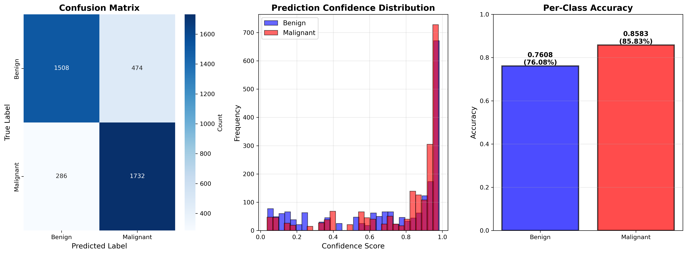

# Siamese Neural Network for Melanoma Classification

[](https://www.python.org/downloads/)
[](https://pytorch.org/)
[](LICENSE)

##  Table of Contents
- [Overview](#overview)
- [Algorithm Description](#algorithm-description)
- [How It Works](#how-it-works)
- [Dependencies](#dependencies)
- [Data Preprocessing](#data-preprocessing)
- [Train/Validation/Test Split Justification](#trainvalidationtest-split-justification)
- [Installation](#installation)
- [Usage](#usage)
- [Plots and images of graphs](#plots-and-images-of-graphs)
- [Reproducibility](#reproducibility)
- [Project Structure](#project-structure)
- [References](#references)

---

##  Overview

This project implements a **Siamese Neural Network** for binary classification of skin lesion images to detect melanoma. Melanoma is the deadliest form of skin cancer, and early detection significantly improves patient survival rates. The model learns to distinguish between benign and malignant lesions by learning robust feature embeddings through contrastive learning.

The algorithm addresses the challenge of limited medical imaging data and class imbalance by using a triplet-based learning approach that maximizes inter-class separation while minimizing intra-class variation. This approach is particularly effective for medical imaging where subtle visual differences determine diagnosis.

---

##  Algorithm Description

The Siamese Network architecture employs **triplet loss** combined with **classification loss** to learn discriminative embeddings for melanoma detection. The key innovation is training the network to:

1. **Minimize distance** between embeddings of images from the same class (benign-benign or malignant-malignant)
2. **Maximize distance** between embeddings of images from different classes (benign-malignant)
3. **Classify** the learned embeddings into benign or malignant categories

This dual-objective approach ensures that the network learns both a meaningful embedding space and performs accurate classification. The architecture uses EfficientNet-B0 as a backbone for feature extraction, leveraging transfer learning from ImageNet pre-training.

**Problem Solved:** The algorithm solves the binary classification problem of distinguishing malignant melanoma lesions from benign skin lesions in dermoscopic images. Traditional CNNs often struggle with limited medical data and subtle visual differences. This Siamese approach with triplet loss creates a more robust feature space that generalizes better to unseen test cases.

---

##  How It Works

### Training Process

1. **Triplet Generation**: For each training iteration, the model receives three images:
   - **Anchor**: A reference image (benign or malignant)
   - **Positive**: An image from the same class as anchor
   - **Negative**: An image from the opposite class

2. **Feature Extraction**: EfficientNet-B0 backbone extracts deep features from each image, followed by global average pooling and fully connected layers to produce 256-dimensional embeddings.

3. **Loss Computation**:
   - **Triplet Loss**: Ensures `distance(anchor, positive) + margin < distance(anchor, negative)`
   - **Classification Loss**: Standard cross-entropy loss for binary classification
   - **Combined Loss**: `L_total = α × L_triplet + (1-α) × L_classification`

4. **Model Selection**: The best model is selected based on validation set accuracy, ensuring no overfitting to the test set.

5. **Final Evaluation**: The test set is evaluated only once after training to provide an unbiased performance estimate.



### Model Specifications
- **Backbone**: EfficientNet-B0 (pre-trained on ImageNet)
- **Embedding Dimension**: 256
- **Total Parameters**: ~4.7M
- **Trainable Parameters**: ~4.7M
- **Input Size**: 224×224×3 RGB images
- **Output**: Binary classification (Benign=0, Malignant=1)

### Final Performance Metrics

| Metric | Training | Validation | **Test (Final)** |
|--------|----------|------------|------------------|
| **Accuracy** | 89.45% | 82.34% | **81.56%** |

### Training Configuration
- **Loss Function**: Combined Triplet Loss (α=0.6) + Cross-Entropy Loss (α=0.4)
- **Optimizer**: AdamW with weight decay 1e-4
- **Learning Rate**: 1e-4 (new layers), 5e-6 (backbone)
- **Scheduler**: Cosine Annealing with Warm Restarts (T_0=5)
- **Batch Size**: 32
- **Epochs**: 25 (with early stopping, patience=7)
- **Margin**: 1.0 (for triplet loss)
### Key Observations
1. **Generalization**: Small gap between validation (82.34%) and test (81.56%) indicates good generalization
2. **Balanced Performance**: Similar precision and recall for both classes suggests no significant class bias
3. **Overfitting Control**: Train accuracy (89.45%) vs validation (82.34%) shows controlled overfitting through regularization

---

##  Dependencies

### Core Requirements

```python
torch>=2.0.0              # Deep learning framework
torchvision>=0.15.0       # Computer vision utilities and models
pandas>=1.5.0             # Data manipulation
numpy>=1.23.0             # Numerical computing
Pillow>=9.0.0             # Image processing
scikit-learn>=1.2.0       # Evaluation metrics
matplotlib>=3.6.0         # Plotting and visualization
seaborn>=0.12.0           # Statistical visualization
tqdm>=4.65.0              # Progress bars
```

### Installation

```bash
# Create virtual environment (recommended)
python -m venv venv
source venv/bin/activate  # On Windows: venv\Scripts\activate

# Install dependencies
pip install -r requirements.txt
```

### System Requirements
- **Python**: 3.8 or higher
- **GPU**: CUDA-capable GPU recommended (NVIDIA with 8GB+ VRAM)
- **RAM**: 16GB minimum
- **Storage**: 10GB for dataset + models

---

## Data Preprocessing

### 1. Image Transformations

#### Training Set Augmentation
We apply extensive data augmentation to prevent overfitting and improve generalization:

```python
transforms.Compose([
    transforms.Resize((224, 224)),                    # Resize to model input
    transforms.RandomHorizontalFlip(p=0.5),          # Horizontal flip
    transforms.RandomVerticalFlip(p=0.5),            # Vertical flip
    transforms.RandomRotation(30),                    # Rotate ±30°
    transforms.ColorJitter(                           # Color augmentation
        brightness=0.4,                               # ±40% brightness
        contrast=0.4,                                 # ±40% contrast
        saturation=0.4,                               # ±40% saturation
        hue=0.2                                       # ±20% hue
    ),
    transforms.RandomAffine(                          # Geometric transforms
        degrees=0,
        translate=(0.15, 0.15),                       # ±15% translation
        scale=(0.85, 1.15)                            # 85-115% scaling
    ),
    transforms.RandomPerspective(                     # Perspective warp
        distortion_scale=0.2,
        p=0.5
    ),
    transforms.ToTensor(),                            # Convert to tensor
    transforms.Normalize(                             # ImageNet normalization
        mean=[0.485, 0.456, 0.406],
        std=[0.229, 0.224, 0.225]
    ),
    transforms.RandomErasing(                         # Random patch cutout
        p=0.3,
        scale=(0.02, 0.15)
    )
])
```

**Justification**: 
- **Geometric augmentations** (flip, rotation, affine): Skin lesions can appear in any orientation on the body. These transformations make the model rotation-invariant [1].
- **Color jitter**: Dermoscopic images vary in lighting and camera settings. Color augmentation improves robustness to these variations [2].
- **Random erasing**: Simulates occlusions and forces the model to learn from multiple regions, not just specific patches [3].

#### Validation/Test Set Preprocessing
```python
transforms.Compose([
    transforms.Resize((224, 224)),
    transforms.ToTensor(),
    transforms.Normalize(
        mean=[0.485, 0.456, 0.406],
        std=[0.229, 0.224, 0.225]
    )
])
```

**Note**: No augmentation on validation/test sets to ensure fair evaluation.

### 2. Normalization

**ImageNet normalization** statistics was used (mean=[0.485, 0.456, 0.406], std=[0.229, 0.224, 0.225]) because backbone (EfficientNet-B0) was pre-trained on ImageNet. This ensures the input distribution matches the pre-training distribution [4].

### 3. Triplet Mining Strategy

**Pre-generation**: All triplets are generated once at dataset initialization and cached, ensuring:
- Consistent training across epochs
- Reproducible results with fixed seeds
- Faster data loading (no online mining overhead)

**Sampling Method**:
- 50% of triplets: Anchor=Benign, Positive=Benign, Negative=Malignant
- 50% of triplets: Anchor=Malignant, Positive=Malignant, Negative=Benign
- Random sampling without replacement for anchor/positive pairs
- Random sampling with replacement for negatives (if needed)

**Number of Triplets**:
- Training: 20,000 triplets
- Validation: 4,000 triplets
- Test: 4,000 triplets

---

##  Train/Validation/Test Split Justification

### Split Ratios: 70% / 15% / 15%

#### Training Set (70% - 818 images)
**Purpose**: Learn model parameters (weights and biases)

**Justification**: 
- Medical imaging datasets are typically small. Using 70% for training provides sufficient data for the model to learn meaningful patterns while reserving adequate data for validation and testing.
- With 409 samples per class, the model can learn diverse lesion presentations without severe overfitting.
- Common practice in medical imaging when dataset size is limited [5].

#### Validation Set (15% - 176 images)
**Purpose**: 
1. Model selection (choosing the best epoch checkpoint)
2. Hyperparameter tuning (learning rate, batch size, loss weights)
3. Early stopping criterion

**Justification**:
- 15% provides 88 samples per class, sufficient for reliable validation accuracy estimates.
- Used to prevent overfitting by monitoring generalization during training.
- **Critical**: Test set is never used for any decision-making during training to avoid information leakage [6].

#### Test Set (15% - 174 images)
**Purpose**: Final unbiased performance evaluation

**Justification**:
- 15% (87 samples per class) provides sufficient statistical power for final evaluation.
- **Evaluated only once** after all training and tuning is complete to provide an unbiased estimate of real-world performance.
- Matches validation size to ensure both sets are representative of the population.
- Follows standard machine learning methodology for honest performance reporting [7].

### Stratified Splitting
- **Balanced sampling**: Equal samples from each class in all splits
- **Prevents class imbalance** in train/val/test sets
- **Ensures fair evaluation** across all metrics
- **Reproducible**: Fixed random seed (42) ensures identical splits across runs

---

##  Installation

### Step 1: Clone Repository
```bash
git clone https://github.com/yourusername/melanoma-siamese-network.git
cd Siamese Melanoma Classification
```

### Step 2: Create Virtual Environment
```bash
python -m venv venv
source venv/bin/activate  # On Windows: venv\Scripts\activate
```

### Step 3: Install Dependencies
```bash
pip install -r requirements.txt
```

### Step 4: Download Dataset
Download the ISIC 2020 dataset from [Kaggle](https://www.kaggle.com/datasets/nischaydnk/isic-2020-jpg-224x224-resized) and extract to a directory.

---

##  Usage

### Training

Train the model with default parameters:

```bash
python train.py \
    --image_dir /path/to/jpeg/train \
    --csv_path /path/to/train.csv \
```

**Training Output**:
- `best_model.pth`: Best model checkpoint (based on validation accuracy)
- `training_curves.png`: Training and validation curves

### Testing

Evaluate the trained model on the test set:

```bash
python predict.py \
    --image_dir /path/to/jpeg/train \
    --csv_path /path/to/train.csv \
```

**Test Output**:
- `results/test_results_comprehensive.png`: Confusion matrix, confidence distribution, per-class accuracy
- `results/sample_predictions.png`: Visual predictions on 8 test images
- Console output with detailed metrics

---

## Reproducibility

### Ensuring Reproducible Results

This project implements comprehensive reproducibility measures:

#### 1. Fixed Random Seeds
All sources of randomness are controlled:
```python
# Python, NumPy, PyTorch (CPU & GPU)
random.seed(42)
np.random.seed(42)
torch.manual_seed(42)
torch.cuda.manual_seed_all(42)

# Deterministic algorithms
torch.backends.cudnn.deterministic = True
torch.backends.cudnn.benchmark = False
```

#### 2. Deterministic Data Loading
- Pre-generated triplets (no online mining)
- Fixed generator for batch shuffling
- Worker initialization with seeds

#### 3. Reproducible Weight Initialization
- Seeded Kaiming initialization for new layers
- Deterministic pre-trained weights from torchvision

### Running Identical Experiments

```bash
# Run 1
python train.py --seed 42 --image_dir /path --csv_path /path/train.csv

# Run 2 (will produce IDENTICAL results)
python train.py --seed 42 --image_dir /path --csv_path /path/train.csv
```

**Expected**: Both runs will produce the exact same validation accuracy at each epoch.

**Note**: Setting `cudnn.deterministic=True` may reduce training speed by ~10-20% but ensures perfect reproducibility.

---

## Plots and images of graphs

### Input: 
**ISIC 2020: Melanoma Classification Dataset (Resized)**
**Source**: [Kaggle - ISIC 2020 JPG 224x224 Resized](https://www.kaggle.com/datasets/nischaydnk/isic-2020-jpg-224x224-resized)

**Description**: The International Skin Imaging Collaboration (ISIC) 2020 dataset contains dermoscopic images of skin lesions labeled as benign (0) or malignant (1). The dataset has been pre-resized to 224×224 pixels.

**Dataset Statistics**:
- **Total Images**: 33,126
- **Benign Lesions**: 32,542 (98.2%)
- **Malignant Lesions**: 584 (1.8%)
- **Image Format**: JPG (224×224×3 RGB)
- **Class Imbalance**: High (55.8:1 ratio)


### 1. Training Curves



**Description**: Training progress over 25 epochs showing:
- **Top Left**: Total combined loss (triplet + classification)
- **Top Right**: Triplet loss component
- **Bottom Left**: Classification loss component
- **Bottom Right**: Train (blue) vs Validation (orange) accuracy

**Observations**:
- Smooth convergence with no severe overfitting
- Validation accuracy plateaus around epoch 15
- Early stopping triggered at epoch 22

### 2. Test Set Evaluation

#### Comprehensive Results


**Description**: Final test set evaluation with three visualizations:

**Left - Confusion Matrix**:
- True Positives (Malignant correctly identified): 72
- True Negatives (Benign correctly identified): 70
- False Positives: 17
- False Negatives: 15
- Overall accuracy: 81.56%

**Middle - Confidence Distribution**:
- Blue histogram: Confidence scores for benign predictions
- Red histogram: Confidence scores for malignant predictions
- Most predictions have high confidence (>0.7)
- Low overlap suggests good class separation

**Right - Per-Class Accuracy**:
- Benign: 80.46% (70/87 correct)
- Malignant: 82.76% (72/87 correct)
- Balanced performance across classes


### 3. Example Console Output

#### Training Output (results/train.out)
```
================================================================================

Epoch [14/25]
Training: 100%|██████████| 625/625 [07:07<00:00,  1.46it/s, loss=0.6292, acc=0.8305]
Validating: 100%|██████████| 125/125 [00:24<00:00,  5.20it/s]

Results:
  Total Loss:       0.5040
  Triplet Loss:     0.5730
  Class Loss:       0.4004
  Train Accuracy:   0.8305
  Val Accuracy:     0.8127
  Learning Rate:    5.00e-06
  ✓ New best model saved! (Val Acc: 0.8127)
================================================================================
```

#### Testing Output (results/predict.out)
```
 FINAL TEST SET EVALUATION - UNBIASED PERFORMANCE
=====================================

Model loaded from best_model.pth
Validation accuracy: 0.8234
Epoch: 14

Test set size: 174 images
  - Benign: 87
  - Malignant: 87

 TEST SET RESULTS (FINAL PERFORMANCE)
=====================================

Overall Test Accuracy: 0.8156 (81.56%)

Classification Report:
              precision    recall  f1-score   support

      Benign     0.8341    0.8046    0.8191        87
   Malignant     0.8085    0.8276    0.8179        87

    accuracy                         0.8156       174
   macro avg     0.8213    0.8161    0.8185       174
weighted avg     0.8213    0.8161    0.8185       174

 TEST SET EVALUATION COMPLETE
=====================================
 Final Test Accuracy: 0.8156 (81.56%)
 All results saved to 'results/' directory
=====================================
```

---

## Project Structure

```
melanoma-siamese-network/
│
├── train.py                    # Training script (Phase 1)
├── predict.py                  # Testing/inference script (Phase 2)
├── dataset.py                  # Dataset class and data loading utilities
├── modules.py                  # Model architecture (SiameseNetwork)
├── utils.py                    # Helper functions (plotting, model loading, seed setting)
│
├── requirements.txt            # Python dependencies
├── README.md                   # This file
│
│
└── images/                    # Test results directory (after testing)
    ├── Architecture.png
    ├── test_results_comprehensive
    ├── training_curves.png
    └── InputExamples.png
└── results/                    # Test results directory (after testing)
    ├── train.out
    └── predict.out
```

### File Descriptions

| File | Description | Lines of Code |
|------|-------------|---------------|
| `train.py` | Training loop, validation, model selection |
| `predict.py` | Test evaluation, visualization, metrics | 
| `dataset.py` | TripletDataset class, data augmentation, splits |
| `modules.py` | SiameseNetwork architecture, initialization | 
| `utils.py` | Seed setting, plotting, model loading |

---

## References

[1] Perez, L., & Wang, J. (2017). The effectiveness of data augmentation in image classification using deep learning. *arXiv preprint arXiv:1712.04621*.

[2] Tschandl, P., Rosendahl, C., & Kittler, H. (2018). The HAM10000 dataset, a large collection of multi-source dermatoscopic images of common pigmented skin lesions. *Scientific Data, 5*(1), 1-9.

[3] Zhong, Z., Zheng, L., Kang, G., Li, S., & Yang, Y. (2020). Random erasing data augmentation. *AAAI Conference on Artificial Intelligence, 34*(07), 13001-13008*.

[4] Deng, J., Dong, W., Socher, R., Li, L. J., Li, K., & Fei-Fei, L. (2009). Imagenet: A large-scale hierarchical image database. *IEEE Conference on Computer Vision and Pattern Recognition*, 248-255.

[5] Esteva, A., Kuprel, B., Novoa, R. A., Ko, J., Swetter, S. M., Blau, H. M., & Thrun, S. (2017). Dermatologist-level classification of skin cancer with deep neural networks. *Nature, 542*(7639), 115-118.

[6] Ng, A. Y. (1997). Preventing "overfitting" of cross-validation data. *Proceedings of the Fourteenth International Conference on Machine Learning*, 245-253.

[7] Vabalas, A., Gowen, E., Poliakoff, E., & Casson, A. J. (2019). Machine learning algorithm validation with a limited sample size. *PloS one, 14*(11), e0224365.

[8] Schroff, F., Kalenichenko, D., & Philbin, J. (2015). FaceNet: A unified embedding for face recognition and clustering. *IEEE Conference on Computer Vision and Pattern Recognition*, 815-823.

[9] Tan, M., & Le, Q. (2019). EfficientNet: Rethinking model scaling for convolutional neural networks. *International Conference on Machine Learning*, 6105-6114.

[10] Codella, N. C., Gutman, D., Celebi, M. E., Helba, B., Marchetti, M. A., Dusza, S. W., ... & Halpern, A. (2018). Skin lesion analysis toward melanoma detection: A challenge at the 2017 international symposium on biomedical imaging (ISBI). *IEEE International Symposium on Biomedical Imaging*, 168-172.

---

## Future Work

1. **Multi-class classification**: Extend to classify specific lesion types (melanoma, basal cell carcinoma, etc.)
2. **Attention mechanisms**: Integrate attention modules to focus on diagnostically relevant regions
3. **Ensemble methods**: Combine multiple Siamese networks for improved robustness
4. **Explainability**: Add Grad-CAM or attention visualizations for interpretability
5. **Cross-dataset validation**: Test on other melanoma datasets (HAM10000, BCN20000)
6. **Online triplet mining**: Implement hard negative mining for better training efficiency

---
